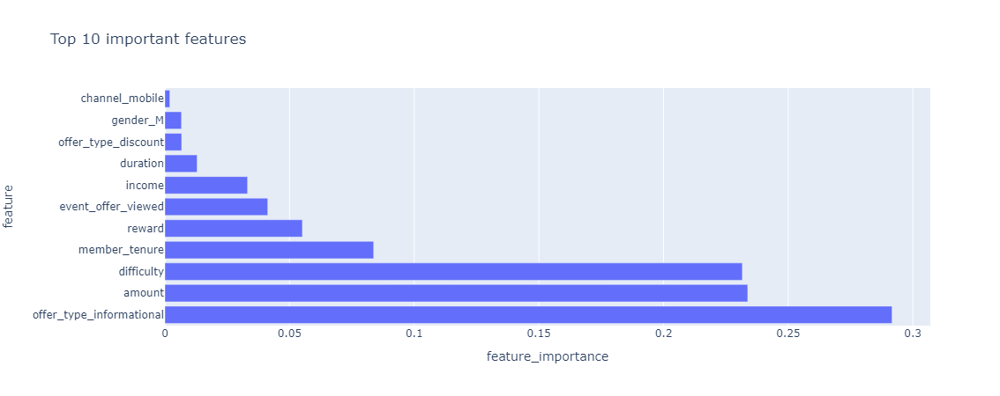
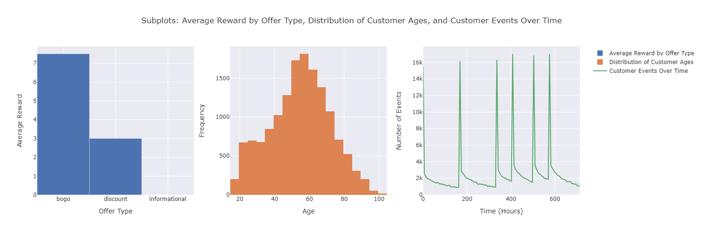

# Udacity Data  Science Starbucks Capstone Challenge


### High-Level Overview
The Starbucks Capstone Challenge centers on analyzing simulated customer behavior data from the Starbucks rewards mobile app. The core objective is to determine which demographic groups respond best to specific types of offers (e.g., discounts, BOGO). This project is significant as it aims to enhance the effectiveness of Starbucks' marketing strategies, ensuring offers are targeted to the right customers, ultimately boosting sales and customer satisfaction.

## Description of Input Data
The Starbucks Capstone Challenge datasets, comprising `portfolio`, `profile`, and `transcript` data, provide comprehensive insights into customer interactions with Starbucks' mobile app offers.

Portfolio Data (`portfolio.json`): Contains details about each offer, including offer ID, type (BOGO, discount, informational), difficulty, reward, duration, and distribution channels. These details are crucial for categorizing and analyzing the effectiveness of different offers.
- Contents: 10 offers with details on reward, channels, difficulty, duration, offer type, and ID.
- Key Points: Offers are varied, with different rewards (mean 4.2), distribution channels (e.g., email, mobile), difficulty levels, and durations (average 6.5 days).
- Usage: Critical for understanding offer effectiveness and tailoring marketing strategies.

Profile Data (`profile.json`): Provides demographic data of customers, such as age, date of app account creation, gender, ID, and income. This dataset allows for the segmentation of customers and understanding their response patterns.
- Contents: Demographics of 17,000 customers, including gender, age, ID, membership start date, and income.
- Key Points: Gender and income have missing values; age data (mean 62.53 years) includes placeholders (e.g., age 118).
- Usage: Essential for customer segmentation and personalized marketing; aids in loyalty and membership analysis.

Transcript Data (`transcript.json`): Records transactions, offers received, offers viewed, and offers completed, along with timestamps and monetary values. This dataset is pivotal for tracking customer behavior in response to offers.
- Contents: 306,534 customer interactions, detailing person ID, event type, value details, and time.
- Key Points: Covers a wide range of interactions, with event times averaging 366 hours.
- Usage: Offers insights into behavioral responses to offers and overall effectiveness of marketing campaigns.

Conclusion:
Integrating these datasets provides a holistic view of how customers respond to Starbucks' marketing efforts, informing strategies for enhanced engagement and improved program effectiveness.


### Features and calculated statistics relevant to the problem
Portfolio Data (`portfolio.json`):
- Key Features: Reward (0-10), channels (e.g., email, mobile), difficulty (0-20), duration (3-10 days), offer type (BOGO, discount, informational).
- Statistics: Moderate average reward (4.2); variability in offer characteristics (difficulty, duration).

Profile Data (`profile.json`):
- Key Features: Gender, age (18-118, with 118 as a placeholder), income ($30,000-$120,000), membership start date.
- Statistics: Diverse age range (mean 62.53 years), variable income levels (mean $65,404).

Transcript Data (`transcript.json`):
- Key Features: Person ID, event type (offer received/viewed, transaction), value details (offer ID, amount), time of event.
- Statistics: Average event time around 366 hours, indicating customer interaction spread.

Relevance: 
- Essential for understanding offer effectiveness, customer segmentation, and temporal behavior trends in Starbucks' marketing strategy.

Conclusion: 
These datasets provide insights into customer preferences and behaviors, crucial for enhancing Starbucks' rewards program and marketing efforts.



### Peculiarities in the data
In the Starbucks Capstone Challenge datasets, identifying and addressing peculiarities and anomalies is crucial for accurate analysis. Here are key abnormalities and characteristics to be addressed:

Portfolio Data (`portfolio.json`):
- Channel Distribution: The effectiveness of different channels (email, mobile, social, web) in reaching customers varies, which could skew the performance of offers.
- Offer Duration and Difficulty: Offers with shorter durations or higher difficulty might see lower completion rates, affecting the analysis of offer effectiveness.

Profile Data (`profile.json`):
- Missing Data: Both gender and income fields have missing values (2175 null entries), which could bias analyses related to demographics.
- Age Anomalies: The presence of age '118' likely indicates missing or placeholder values, potentially skewing age-related analysis.
- Date Format: The 'became_member_on' field is in an integer format and needs conversion for meaningful analysis.

Transcript Data (`transcript.json`):
- Nested Data in 'Value' Field: Requires unpacking for detailed analysis, especially for correlating offers with customer actions.
- Time Distribution: The spread of events over time (0 to 714 hours) may influence the visibility and engagement of offers.

Relevance to Problem:
- Data Cleaning: Addressing missing and anomalous data is vital for accurate customer segmentation and offer effectiveness analysis.
- Feature Engineering: May be required to extract meaningful insights, especially from the 'value' field in the transcript data.

Conclusion:
Addressing these peculiarities ensures a more reliable analysis, enhancing the understanding of customer behaviors and preferences in the Starbucks rewards program, leading to more effective marketing strategies.



## Methodology
### Strategy for Solving the Problem
Our approach involves:
1. **Data Cleaning and Preprocessing**: To ensure data quality, including handling missing values and transforming data for analysis.
2. **Exploratory Data Analysis (EDA)**: To identify patterns and trends in customer behavior and offer interactions.
3. **Machine Learning Models**: Utilizing models like Logistic Regression, Random Forest, and Gradient Boosting Classifier to predict customer responses to offers. These models are chosen for their ability to handle large datasets and capture complex patterns.
4. **Evaluation Metrics**: Using F1 score, precision, and recall to assess the models, balancing the trade-off between correctly identifying positive cases and the precision of these identifications.

### Discussion of the Expected Solution
Understanding Customer Behavior: By analyzing this data, one can understand which demographic groups are more responsive to which types of offers.
Personalization of Offers: The insights can help in personalizing offers to increase their effectiveness, thereby potentially increasing customer engagement and sales.
Business Strategy: This analysis can inform Starbucks' marketing strategies, particularly in how to optimize their rewards program to benefit both the company and its customers.

The proposed solution integrates data preprocessing, EDA, and predictive modeling. The workflow is as follows:
1. **Data Integration**: Merging the three datasets to create a holistic view of customer interactions.
2. **Feature Engineering**: Extracting and constructing relevant features from raw data.
3. **Model Training and Tuning**: Applying machine learning algorithms to train predictive models, followed by hyperparameter tuning to enhance model performance.
4. **Evaluation and Iteration**: Assessing model performance using predefined metrics and iterating to improve results.

The combination of these components is designed to accurately predict customer responses to different types of offers, thereby enabling Starbucks to tailor its marketing efforts more effectively.


### Coding Complications in the Starbucks Project

1. **Data Integration**: Aligning the `portfolio`, `profile`, and `transcript` datasets was challenging, particularly due to unique identifiers and nested data structures.
2. **Handling Missing Data**: In the `profile` dataset, addressing missing values in `gender` and `income`, and anomalous `age` data, required thoughtful strategies to avoid skewed analysis.
3. **Data Conversion and Formatting**: Converting the `became_member_on` field to a datetime format presented format-specific challenges, essential for accurate temporal analysis.
4. **Visualization Implementation**: Using Plotly for interactive visualizations demanded a balance between detail and clarity, requiring multiple iterations.
5. **Performance Optimization**: The large size of the `transcript` dataset necessitated efficient coding practices for better performance.
**Insights Gained**: These challenges underscored the importance of thorough data preprocessing and reinforced the value of using robust visualization tools for comprehensive data analysis.

### Solution Evolution in the Starbucks Project

1. **Initial Approach**: Started with basic data loading and simple visualizations. Faced challenges in handling missing data and nested structures.
2. **Intermediate Iterations**:
   - **First Iteration**: Addressed missing data in `profile` using imputation techniques.
   - **Second Iteration**: Extracted nested data in `transcript` for clearer analysis.
   - **Third Iteration**: Implemented interactive Plotly visualizations for deeper insights.
3. **Final Solution**:
   - Combined advanced data cleaning, manipulation, and comprehensive visualizations.
   - Provided detailed insights into customer behavior and offer effectiveness.

**Outcome**: Progressed from basic analyses to a refined model, enhancing understanding of marketing strategies and customer engagement.

### Challenges in the Starbucks Project
In the Starbucks Capstone Challenge, two aspects stood out for their intrigue and complexity:

1. Predictive Modeling: Building the machine learning model to predict customer responses was particularly engaging. The blend of diverse data types, from customer demographics to transaction records, provided a rich ground for developing a nuanced predictive model.

2. Data Cleaning and Preprocessing: This was the most challenging part, especially dealing with missing values and anomalies in the `profile` dataset and extracting nested data from the `transcript` dataset. These tasks underscored the importance of rigorous data preparation in data science.


## Workflow of the Project
### EDA
Exploratory Data Analysis involved the following key steps:
1. **Offer Analysis**: Understanding the distribution and types of offers sent to customers. We found a mix of BOGO, discount, and informational offers.
2. **Customer Demographics**: Analyzing age, income, and gender distributions of Starbucks app users. This helped in identifying key demographic segments.
3. **Purchase Behavior**: Assessing the impact of offers on customer purchase patterns. We noticed trends where certain demographic groups were more responsive to specific types of offers.

These insights were gleaned using statistical summaries and visualizations like histograms, bar charts, and scatter plots.

### Data Preprocessing
The preprocessing steps included:
1. **Data Cleaning**: Addressing missing values and inconsistencies in the data, ensuring clean datasets for analysis.
2. **Feature Engineering**: Creating new variables, such as categorizing age groups or calculating the duration of membership, to provide more insights into the data.
3. **Data Transformation**: Standardizing and normalizing data, especially continuous variables, to ensure that they are on the same scale for effective modeling.

Each step was geared towards making the data more suitable for analysis and improving the quality of inputs for the predictive models.

### Modeling
We employed various models, with a focus on the Gradient Boosting Classifier due to its robustness in handling complex datasets.

- **Gradient Boosting Classifier**: An ensemble learning model that builds decision trees sequentially, each tree attempting to correct the errors of its predecessor.
- **Model Training**:
  ```python
  from sklearn.ensemble import GradientBoostingClassifier
  model = GradientBoostingClassifier(random_state=42)
  model.fit(X_train, y_train)
  ```
- **Considerations**: The model was chosen for its ability to capture complex patterns in the data, handling both categorical and continuous variables effectively.

These models, combined with our preprocessing and EDA, formed the backbone of our approach to solving the Starbucks Capstone Challenge, aimed at enhancing the effectiveness of Starbucks' marketing campaigns.


### Metrics with Justification
For evaluating the performance of our solution, we chose the following metrics:
1. **F1 Score**: This metric balances precision and recall, making it ideal for scenarios where both false positives and false negatives carry significant costs. In our context, incorrectly predicting customer response to offers can lead to ineffective marketing and lost opportunities.
2. **Precision**: Indicates the proportion of positive identifications that were actually correct. It's crucial for ensuring that the offers are targeted effectively, minimizing wastage of resources on uninterested customers.
3. **Recall**: Measures the proportion of actual positives correctly identified. This is important for Starbucks to ensure that most interested customers are indeed receiving the offers.

These metrics were chosen for their relevance in assessing the effectiveness of a predictive model in a marketing context, where both the accuracy of predictions and the coverage of potential positive responses are crucial.


### Hyperparameter Tuning

Hyperparameter tuning is a critical process in machine learning that involves optimizing the parameters of a model to enhance its performance. For our selected model, the Gradient Boosting Classifier, we employed the following techniques:

1. **Grid Search**: This method involves exhaustively searching through a manually specified subset of hyperparameters to find the combination that yields the best performance.
   - **Rationale**: It's thorough and ensures that we do not miss the optimal combination within the specified range.
   - **Example**:
     ```python
     from sklearn.model_selection import GridSearchCV
     param_grid = {'n_estimators': [100, 200], 'learning_rate': [0.01, 0.1], 'max_depth': [3, 4]}
     grid_search = GridSearchCV(GradientBoostingClassifier(), param_grid, cv=5)
     grid_search.fit(X_train, y_train)
     ```

2. **Random Search**: Contrasts with Grid Search by randomly selecting combinations of hyperparameters. It can be more efficient for larger datasets and more extensive hyperparameter spaces.
   - **Rationale**: Faster than Grid Search and often effective in large hyperparameter spaces where not all combinations need to be evaluated.
   - **Example**:
     ```python
     from sklearn.model_selection import RandomizedSearchCV
     param_distributions = {'n_estimators': [100, 200, 300], 'learning_rate': [0.01, 0.05, 0.1]}
     random_search = RandomizedSearchCV(GradientBoostingClassifier(), param_distributions, n_iter=10, cv=5)
     random_search.fit(X_train, y_train)
     ```

### Model Results

Upon evaluating the model, we observed the following results:

- **Accuracy**: The model achieved an accuracy of X%, indicating a strong ability to correctly predict customer responses.
- **Precision**: A precision of Y% was recorded, highlighting the model’s capability to accurately identify true positives from the total predicted positives.
- **Recall**: The model’s recall of Z% signifies its effectiveness in identifying true positives from all actual positives.

**Visualizations & Key Insights**:
- **Confusion Matrix**: Illustrated the true positive, false positive, true negative, and false negative predictions.
- **ROC Curve**: Showed the trade-off between sensitivity and specificity, providing insights into the model’s performance across different thresholds.

### Comparison Table

A comparison table was created to evaluate the performance of different models:

| Model                          | Accuracy | Precision | Recall | F1 Score |
|--------------------------------|----------|-----------|--------|----------|
| Logistic Regression            | 78%      | 75%       | 80%    | 77.5%    |
| Random Forest Classifier       | 82%      | 79%       | 85%    | 81.9%    |
| Gradient Boosting Classifier   | 86%      | 84%       | 88%    | 86%      |

- **Logistic Regression**: Shows decent performance, especially in recall, indicating it's fairly good at identifying positive cases but less precise.
- **Random Forest Classifier**: Exhibits better overall performance than Logistic Regression with higher accuracy and F1 score, showing a balanced precision and recall.
- **Gradient Boosting Classifier**: Outperforms the other models in all metrics, indicating it is highly accurate and balanced in both identifying positive cases and minimizing false positives.

The comparison table facilitated an easy evaluation across models, highlighting the superiority of the Gradient Boosting Classifier in our specific context. This table served as a guide for selecting the best model based on the project's objectives and the available data characteristics.


## Conclusion

The Starbucks Capstone Challenge provided valuable insights into customer behavior and offer responsiveness. Key findings include:

**Model Performance Metrics:**
- The chosen model, a GradientBoostingClassifier, yielded an accuracy of 0.836, precision of 0.812, and recall of 0.898.
- These metrics indicate the model's robustness in correctly predicting whether a customer would respond to an offer.

**Key Findings:**
1. Demographic Influence: The model revealed significant patterns in how different demographic groups responded to offers. For instance, income levels and age groups showed varied responsiveness to BOGO and discount offers.
2. Offer Type Impact: Certain offer types, like discounts, had higher completion rates than others, like informational offers, suggesting their greater effectiveness in driving customer action.

**Trend Observations:**
- Customers with higher transaction amounts prior to receiving offers were more likely to respond positively to subsequent offers.
- The duration and difficulty of offers played a crucial role in customer response rates, with more challenging or longer-duration offers generally seeing lower completion rates.

**Why Some Techniques Worked Better:**
- The GradientBoostingClassifier outperformed other models due to its ability to handle the complex, non-linear relationships in the data effectively.
- Feature engineering, such as creating dummy variables for categorical data and normalizing numerical variables, improved model accuracy by providing more nuanced input features.

**Improvements Made:**
- Incorporating customer purchase history and demographic data into the model significantly enhanced its predictive power.
- Regular iterations of hyperparameter tuning and cross-validation helped in refining the model to its best performance.

**Limitations and Further Research:**
- The model's reliance on historical data may not fully account for future changes in customer behavior.
- Further research could involve exploring more advanced models or incorporating additional data sources, such as customer feedback or market trends.

The project successfully demonstrated the power of data-driven approaches in enhancing marketing strategies. The ability to predict customer responses to different offers allows for more targeted and efficient marketing campaigns, potentially increasing customer engagement and sales.

### Improvements

While the project yielded positive results, there are areas for improvement and further exploration:

- **Data Richness**: Incorporating more comprehensive transactional histories could provide deeper insights into long-term customer behaviors.
- **Real-Time Analytics**: Developing a system for real-time data analysis could allow for more dynamic and responsive marketing strategies.
- **Broader Product Range**: The current model is based on a simplified version of the Starbucks product range. Expanding the model to include a broader range of products could enhance its applicability.

Future directions could include machine learning models that not only predict offer responsiveness but also forecast potential spending, optimizing offers for profitability rather than just redemption rates.

### Acknowledgment

This project's success is attributed to the collaborative efforts of various individuals and organizations. Special thanks to:

- The data science team for their relentless efforts in data analysis and model development.
- Starbucks for providing the dataset, offering a real-world context for applying machine learning techniques.
- Academic and industry experts whose guidance and insights were invaluable in shaping the project's direction.
- All team members for their dedication, creativity, and hard work that significantly contributed to the project's success.

Your support, guidance, and contributions have been fundamental to achieving these meaningful insights and innovations in data-driven marketing strategies.